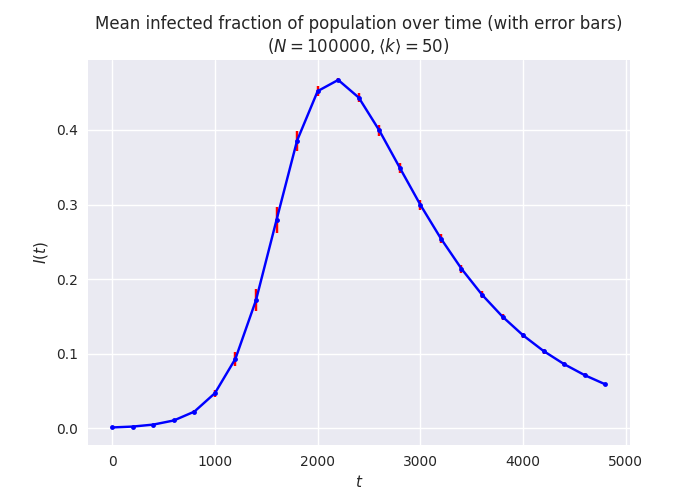
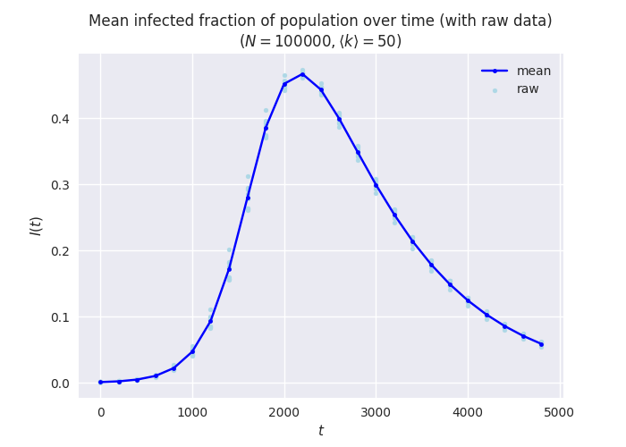

.. _timeseries:

.. currentmodule:: epydemic

Comparing series data
=====================

**Problem**: You collect a time series for a compartment in a
:class:`CompartmentedModel` using :class:`Monitor`, or some other
series data. You then want to compare these series between different
experimental runs, or find the mean of several series. How do you
wrangle the data into a form that can be worked with?

**Solution**: This is really a ``pandas`` question, but one that's
extremely common in network science and so very relevant to ``epydemic``.

The issue is that time series land in a result set as arrays. This
makes them hard to manipulate. What we would probably prefer is a
DataFrame whose rows are the series and whose columns are the
observation times, degrees, or whatever: extracting a sub-set of rows
from the original result set DataFrame and then re-formatting them
into a more suitable shape.

Fortunately ``pandas`` provides the functions we need. It can
create a DataFrame from a list of lists, and we can then rename the
columns to be meaningful.

As an example, suppose we've used :class:`Monitor` to capture the
progression of an :class:`SIR` epidemic on an ER network:

.. code-block:: python

   from epydemic import SIR, Monitor, ProcessSequence, ERNetwork, StochasticDynamics
   from epyc import Lab

   lab = Lab()

   N = int(1e5)
   kmean = 50

   lab[ERNetwork.N] = N
   lab[ERNetwork.KMEAN] = kmean
   lab[SIR.P_INFECTED] = 0.001
   lab[SIR.P_INFECT] = 0.0001
   lab[SIR.P_REMOVE] = 0.001
   lab[Monitor.DELTA] = 1
   lab['repetitions'] = range(10)

   e = StochasticDynamics(ProcessSequence([SIR(), Monitor()]), ERNetwork())
   lab.runExperiment(e)

This will result in a result set with result columns that capture the
size of each locus in the SIR model -- the SI edges and I nodes --
over time. We can retrieve the column name of the time series for the
I locus by:

.. code-block:: python

   c = Monitor.timeSeriesForLocus(SIR.INFECTED)

If we extract the result set for this experiment it will have 10 rows
(one per repetition), and we can project-out just the time series
using:

.. code-block:: python

   df = lab.dataframe()
   tss = df[Monitor.timeSeriesForLocus(SIR.INFECTED)]

Then each row will have a single column, which will itself be an array
-- not quite what we wanted, so now we need to "explode" this
list-like column into a row in a new DataFrame with a more convenient
shape:

.. code-block:: python

   from pandas import DataFrame

   infecteds = DataFrame(tss.values.tolist()).rename(columns=lambda i: i)

This converts the data to "wide" format, creating a DataFrame with the
same rows but with a column per sample rather than one column with an
array of samples.

.. note::

   ``pandas`` has a method called ``DataFrame.explode`` that does
   something slightly different to what we do here, and so isn't
   suitable (unfortunately).

The columns are labelled by the index of the sample point (we need to
do this as otherwise the column labels get confused): since
:class:`Monitor` samples each experiment at the time time points, we
could instead use the experimental times as column labels if we
wanted. by changing the renaming. But there's a problem: although all
the samples happen at the same times, some experimental runs are
longer than others. We therefore need to extract the sample points of
the *longest* experimental run, and use these as column
labels. Shorter runs will then get ``NaN`` ("not a number") values for
times that they didn't sample, and this won't affect any statistics we
compute later. The incantation to do this is:

.. code-block:: python

   ts = df.loc[(df[Monitor.OBSERVATIONS].apply(len) == df[Monitor.OBSERVATIONS].apply(len).max())].iloc[0][Monitor.OBSERVATIONS]

(The outer ``df.loc[]`` extracts all the rows for which the length of
the :attr:`Monitor.OBSERVATIONS` column matches the maximum length,
and then uses ``.iloc[0]`` to extract the first such row  -- there might be
several, but by definition they'll all be the same -- and returns its
values.) We can use these for renaming if we want to:

.. code-block:: python

   infecteds = DataFrame(tss.values.tolist(), columns=ts)

We'll also use this time series for the x-axis ticks on the plot.

Putting it all together we can, for example, generate a plot of the
means and error bars of the size of a compartment over time, taken
across a range of experiments. We'll create this plot across a short
range and space-out the samples to make a clearer plot, and use
``seaborn`` to tweak the presentation style.

.. code-block:: python

   import matplotlib
   import matplotlib.pyplot as plt
   import seaborn
   matplotlib.style.use('seaborn')

   fig = plt.figure(figsize=(7, 5))

   maxt = 5000
   step = 200

   df = lab.dataframe()
   ts = df.loc[(df[Monitor.OBSERVATIONS].apply(len) == df[Monitor.OBSERVATIONS].apply(len).max())].iloc[0][Monitor.OBSERVATIONS]
   infecteds = DataFrame(df[Monitor.timeSeriesForLocus(SIR.INFECTED)].values.tolist()).rename(columns=lambda i: ts[i])

   # compute the mean and standard error of the time series using pandas
   infectedMeans = list(infecteds.mean())
   infectedErrors = list(infecteds.std())

   # plot the mean with error bars
   plt.errorbar(ts[:maxt:step], [I / N for I in infectedMeans[:maxt:step]],
		yerr=[e / N for e in infectedErrors[:maxt:step]],
		color='blue', marker='.',
		ecolor='red', capsize=2)

   plt.ylabel('$I(t)$')
   plt.xlabel('$t$')
   plt.title(f'Mean infected fraction of population over time (with error bars)\n$(N = {N}, \\langle k \\rangle = {kmean})$')

   _ = plt.show()

This is just one choice of plotting style, of course: some people
prefer to plot the raw data rather than just summary statistics. We
can do this too, using the raw exploded data as well as the summaries:

.. code-block:: python

   fig = plt.figure(figsize=(7, 5))

   # plot the raw data time series
   for i in range(len(infecteds)):
       cs = list(infecteds.iloc[i])
       plt.scatter(ts[:maxt:step], [I / N for I in cs[:maxt:step]],
		   color='lightblue', marker='.',                # raw data in a light shade
		   label='raw' if i == 0 else None)              # only one label for all the raw plots

   # plot the mean on top
   plt.plot(ts[:maxt:step], [I / N for I in infectedMeans[:maxt:step]],
	    color='blue', marker='.',                            # mean in a darker shade
	    label='mean')

   plt.ylabel('$I(t)$')
   plt.xlabel('$t$')
   plt.title(f'Mean infected fraction of population over time (with raw data)\n$(N = {N}, \\langle k \\rangle = {kmean})$')

   _ = plt.show()

This has the advantage of showing any outliers in the raw data that
the summary statistics will mask. This can be important when
interpreting the data.
