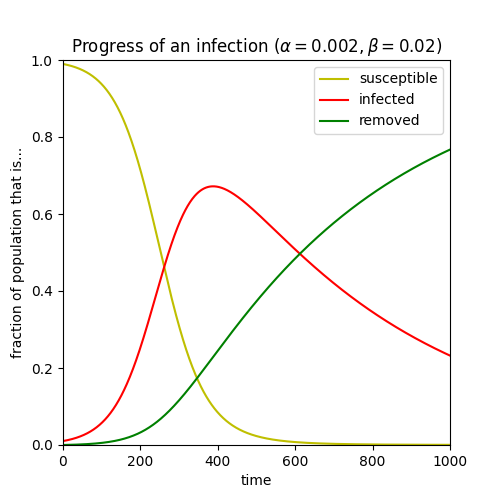
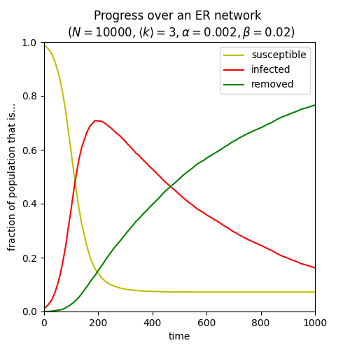
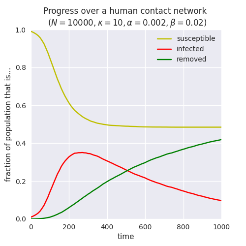

.. _monitoring-progress:

.. currentmodule:: epydemic

Monitoring the progress of a simulation
=======================================

**Problem**: You want to observe how a process evolves over time, capturing a time series
of some property of interest. Then you can use this time series as well as the result
at equilibrium (the end of the simulation) to draw conclusions.

**Solution**: Essentially the problem here is to capture the ongoing state of the
network as the process runs. The most common scenario is that you want to examine
how things change so that you can plot a graph of them, and for this the easiest
approach is to post a repeating event that captures the data you're interested in
at some interval.

Suppose for the sake of argument that we are wanting to verify that an :term:`SIR` process
over a network behaves similarly to the same process in a continuous domain. The continuous
version, described by differential equations, might look like the following:

We need to run an SIR simulation *and at the same time* extract the sizes of its components,
*not* simply wait until equilibrium as is the default. In other words, we need to add *monitoring*
code that will extract this information as the simulation progresses.

We can observe that there are two processes here -- SIR and observation -- which are essentially
independent: the events observing the progress of the epidemic aren't affected by the epidemic
itself. ``epydemic`` includes a :class:`Monitor` class that provides regular monitoring,
so we can simply compose :class:`SIR` and :class:`Monitor` together to form a sequential process.

The :class:`Monitor` class records the sizes of loci. :class:`SIR` has loci for infected
nodes and susceptible-infected edges: if we want to capture the other compartments, we need
to create loci for them too. The resulting class is:

.. code-block:: python

    from epydemic import SIR, ProcessSequence, Montor, ERNetwork, StochasticDynamics

    class MonitoredSIR(SIR):

	def __init__(self):
	    super(MonitoredSIR, self).__init__()

	def build(self, params):
	    '''Build the process, adding additional loci
	    to be monitored.

	    :param params: the parameters'''
	    super(MonitoredSIR, self).setUp(params)

	    # add loci for the other compartments
	    self.trackNodesInCompartment(SIR.SUSCEPTIBLE)
	    self.trackNodesInCompartment(SIR.REMOVED)

We can then use ``epydemic`` to run this process using the same parameters as we used for the
continuous-domain experiment:

.. code-block:: python

   params = dict()

   # use an ER network as the substrate
   params[ERNetwork.N] = 10000
   params[ERNetwork.KMEAN] = 3

   # set the parameters the same as above
   params[SIR.P_INFECT] = 0.02    # infection probability
   params[SIR.P_REMOVE] = 0.002   # recovery probability
   params[epydic.SIR.P_INFECTED] = 0.01  # initial fraction infected

   # capture every 10 timesteps
   params[Monitor.DELTA] = 10

   # build a compund process from the disease and the monitor
   p = ProcessSequence([MonitoredSIR(), Monitor()])

   # run the compound process
   e = StochasticDynamics(p, g=ERNetwork())
   e.process().setMaximumTime(1000)
   rc = e.set(params).run()

The monitor adds a result tagged :attr:`Monitor.TIMESERIES`, which contains a dict keyed
by locus names and containing the size of the locus at each observation. For convenience
there is also a time series keyed by :attr:`Monitor.OBSERVATIONS` that holds the simulation
times at which the observations were made.

.. note::

   If, instead of sub-classing :class:`epydemic.SIR`, we simply used
   the base class, :class:`epydemic.Monitor` would only be able to
   monitor the loci used by the base class (which are
   :attr:`epydemic.SIR.SI` and :attr:`epydemic.SIR.INFECTED` as needed
   by the dynamics). Since we want to keep track of all the
   compartments, we have to record them.

Plotting the results yields:

Of course we can also run the same monitored epidemic over a network with different parameters -- or
even over a network with a completely different topology, such as a powerlaw-with-cutoff that better
models human contact networks:

