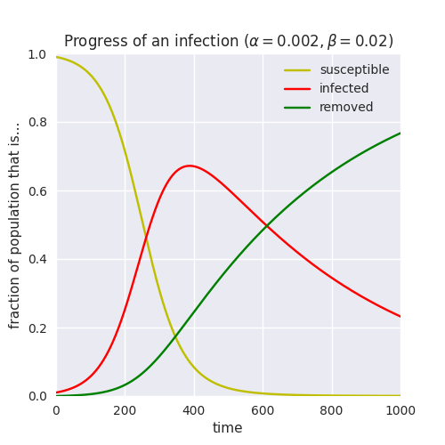

.. _monitoring-progress:

.. currentmodule:: epydemic

Monitoring the progress of a simulation
=======================================

**Problem**: You want to observe how a process evolves over time, capturing a time series
of some property of interest. Then you can use this time series as well as the result
at equilibrium (the end of the simulation) to draw conclusions.

**Solution**: Essentially the problem here is to capture the ongoing state of the
network as the process runs. The most common scenario is that you want to examine
how things change so that you can plot a graph of them, and for this the easiest
approach is to post a repeating event that captures the data you're interested in
at some interval.

Suppose for the sake of argument that we are wanting to verify that an :term:`SIR` process
over a network behaves similarly to the same process in a continuous domain. The continuous
version, described by differential equations, might look like the following:

We need to run an SIR simulation *and at the same time* extract the sizes of its components,
*not* simply wait until equilibrium as is the default. In other words, we need to add *monitoring*
code that will extract this information as the simulation progresses.

We can do this by sub-classing trhe buyilt-in :class:`SIR` model, defining a monitoring event
that performs the monitoring(storing the result in the process object), and then schedule it
to run repeatedly at some time interval by calling :meth:`Process.postRepeatingEvent`:

.. code-block:: python

   class MonitoredSIR(epydemic.SIR):

       INTERVAL = 'interval'
       PROGRESS = 'progress'

       def setUp(self, params):
           '''Schedule the monitoring event.

           :param params: the simulation parameters'''
           super(MonitoredSIR, self).setUp(params)

           # add a monitoring event to fill-in the evolution of the process
           self._series = []
           self.postRepeatingEvent(0, params[self.INTERVAL], None, self.monitor)

       def monitor(self, t, e):
           '''Record the sizes of each compartment.

           :param t: the simulation time
           :param e: the element (ignored)'''
           s = dict()
           for k in [epydemic.SIR.SUSCEPTIBLE, epydemic.SIR.INFECTED, epydemic.SIR.REMOVED]:
               s[k] = len(self.compartment(k))
           self._series.append((t, s))

       def results(self):
           '''Add the time series to the experiment's results.

           :returns: a results dict including the monitored time series'''
           rc = super(MonitoredSIR, self).results()

           rc[self.PROGRESS] = self._series
           return rc

To keep things clean we've also moved the resulting time series of compartment sizes into the results
of the process so that we access it in the same way as any other results.

We can then use ``epydemic`` to run this process using the same parameters as we used for the
continuous-domain experiment:

.. code-block:: python

   # use an ER network as the substrate
   N = 10000
   kmean = 3
   phi = kmean / N
   g = networkx.erdos_renyi_graph(N, phi)

   # set the parameters the same as above
   params = dict()
   params[epydemic.SIR.P_INFECT] = 0.02    # infection probability
   params[epydemic.SIR.P_REMOVE] = 0.002   # recovery probability
   params[epydemic.SIR.P_INFECTED] = 0.01  # initial fraction infected

   # capture every 10s
   params[MonitoredSIR.INTERVAL] = 10

   e = epydemic.StochasticDynamics(MonitoredSIR(), g = g)
   e.process().setMaximumTime(1000)
   rc = e.set(params).run()

Plotting the results yields:

.. figure:: sir-progress-er.png
    :alt: Progression of an epidemic over an ER network
    :align: center

Of course we can also run the same monitored epidemic over a network with different parameters -- or
even over a network with a completely different topology, such as a powerlaw-with-cutoff that better
models human contact networks:

.. figure:: sir-progress-plc.png
    :alt: Progression of an epidemic over a human contact network
    :align: center
