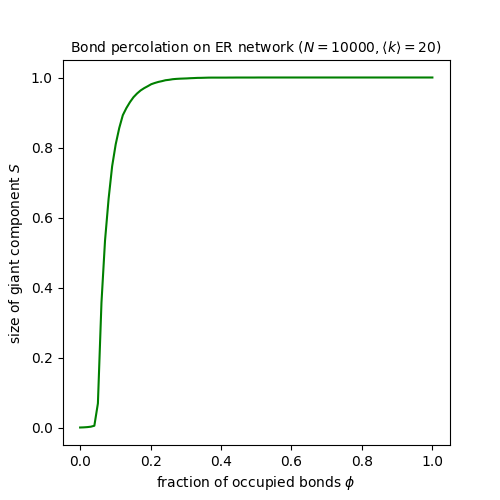

.. _percolation-threshold:

.. currentmodule:: epydemic

Finding the percolation threshold
=================================

**Problem**: You're interested in :term:`percolation` processes,
possibly inspired by the link to SIR epidemics
:cite:`NewmanEpidemicDisease`. You want to find the :term:`percolation
threshold` for a network.

**Solution**: The Newman-Ziff algorithm :cite:`NewmanZiff` is the tool
for the job. It explores the percolation properties of a network for
*all* values of the percolation probability :math:`\phi`.

There are two versions of percolation. In *bond percolation* the edges
are occupied, and the connected component is formed of those nodes
that the edges connect; in *site percolation* the nodes are occupied,
and the connected component is formed from all those occupied nodes
that have edges between them. ``epydemic`` hass two classes,
:class:`BondPercolation` and :class:`SitePercolation`, encoding each
approach. Newman :cite:`NewmanEpidemicDisease` uses bond percolation
to study epidemics.

Let's study bond percolation on an ER network. The theory of
percolation suggests that the GCC typically forms suddenly at some
critical percolation threshold :math:`\phi_c`. Let's use the
Newman-Ziff algorithm to check this. We create a network and run the
bond percolation process across it. This adds edges one at a time and
computes the size of the largest connected component. We expect that,
at some value of :math:`\phi`, the size of this component will
increase very rapidly.

We first create the network:

.. code-block:: python

    from epydemic import BondPercolation, ERNetwork
    from epyc import Experiment

    N = 10000
    kmean = 20

    params = dict()
    params[ERNetwork.N] = N
    params[ERNetwork.KMEAN] = kmean

    g_er = ERNetwork().set(params).generate()

We can then run the bind percolation process on this network:

.. code-block:: python

    e_er = BondPercolation(g_er)
    rc_er = e_er.set(params).run()

This gives us a result set containing two time series, for the
occupation probability and the size of the largest connected
component. We can plot these two against each other:

.. code-block:: python

    import matplotlib.pyplot as plt

    fig = plt.figure(figsize=(5, 5))
    xs = rc_er[Experiment.RESULTS][BondPercolation.P]
    ys = [gcc / N for gcc in rc_er[Experiment.RESULTS][BondPercolation.GCC]]
    plt.plot(xs, ys, 'g-')

    plt.xlabel('fraction of occupied bonds $\phi$')
    plt.ylabel('size of giant component $S$')
    plt.title(f'Bond percolation on ER network ($N = {N}, \\langle k \\rangle = {kmean}$)', size='medium')

This very clearly shows the transition: below a critical value the
largest component is essentially small; above that value, it is
essentially all the network; and there's a very narrow band of values
in which it takes other non-extreme sizes.

The theory of percolation, incidentally, says that the percolation
threshold occurs at a value :math:`\phi_c = \frac{1}{\langle k
\rangle}` :cite:`MolloyReed`, which looks to correspond with the
results of our experiment.
