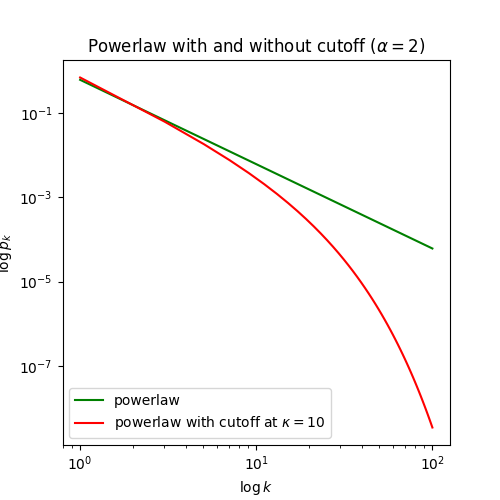

.. _model-human-population:

.. currentmodule:: epydemic

Modelling human contact networks
--------------------------------

*Problem*: You want to work with a realistic model of a human contact network. What is the appropriate topology?

*Solution*: This is an active area of research, but a common answer is to use the approach given by
:ref:`Newman <New02>`, which is to use a powerlaw network with exponential cut-off.

A powerlaw network with exponent :math:`\alpha` has a degree distibution given by

.. math::

    p_k = \frac{1}{C} \, k^{-\alpha}

where :math:`p_k` is the probability that a randomly-chosen node in the network will have degree :math:`k` and
:math:`C` is a normalising constant given by

.. math::

    C = \zeta(\alpha, 1)

with :math:`\zeta` being the `Hurwitz zeta function <https://en.wikipedia.org/wiki/Hurwitz_zeta_function>`_. This
degree distribution has the property that some nodes can have very high degrees with non-zero probability, leading
to very large hubs with high centrality. In a population network this would introduce individuals who were
massively better connected than the others, which is generally considered undesirable: therre are limits to how
many people even the most popular person can actually come into physical contact with.

A powerlaw-with-cutoff network, by contrast, place a limit (denoted :math:`\kappa`) on the "likely" highest degree.
Below the cutoff the degree distribution behaves like a powerlaw network; above the cutoff, the probability drops
off exponentially quickly, making large hubs highly unlikely. This degree distribution is given by

.. math::

    p_k = \frac{1}{C} k^{-\alpha} \, e^{-k / \kappa}

where :math:`C` is again a normalising constant this time given by

.. math::

    C = Li_{\alpha}(e^{-1 / \kappa})

with :math:`Li_{\alpha}(x)` being the :math:`\alpha`'th `polylogarithm <https://en.wikipedia.org/wiki/Polylogarithm>`_
of :math:`x`. The following plot shows the difference in the probability of encountering nodes of different degrees under
the two distributions.

So the probability of finding, for example, a node of degree 100 is :math:`p_k \approx 0.0001` under the powerlaw
distribution, whereas with a cutoff at :math:`\kappa = 10` the probability drops to :math:`p_k \approx 0.00000001`
-- ten thousand times smaller.

Fortunately the polylogarithm function is built into the ``mpmath`` package, so all we need to do is code-up the
distribution function in Python. In the following we create an experiment that can take parameters for the size :math:`N`
of the network, its exponent :math:`\alpha` and cutoff :math:`\kappa`, and constructs a random network:

.. code-block:: python

    import networkx
    import epydemic
    import math
    import numpy
    from mpmath import polylog as Li   # use standard name

    class PWCPopulation(epydemic.CompartmentedStochasticDynamics):
        '''An experimental dynamics that builds a population according to the powerlaw-with-cutoff
        degree distribution.'''

        # parameters
        N = 'networkSize'   #: Size of network to work over
        ALPHA = 'alpha'     #: Exponent of degree distribution
        KAPPA = 'kappa'     #: Cutoff of degree distribution

        def __init__( self, m ):
            '''Create a dynamics over the given model. There is no prototype
            network given as we'll create one using experimental parameters.

            :param m: the model'''
            super(PWCPopulation, self).__init__(m)

        def makePowerlawWithCutoff( self, alpha, kappa ):
            '''Create a model function for a powerlaw distribution with exponential cutoff.

            :param alpha: the exponent of the distribution
            :param kappa: the degree cutoff
            :returns: a model function'''
            C = Li(alpha, math.exp(-1.0 / kappa))
            def p( k ):
                return (pow((k + 0.0), -alpha) * math.exp(-(k + 0.0) / kappa)) / C
            return p

         def generateFrom( self, N, p, maxdeg = 100 ):
            '''Generate a random graph with degree distribution described
            by a model function.

            :param N: number of numbers to generate
            :param p: model function
            :param maxdeg: maximum node degree we'll consider (defaults to 100)
            :returns: a network with the given degree distribution'''

            # construct degrees according to the distribution given
            # by the model function
            ns = []
            t = 0
            for i in range(N):
                while True:
                    k = 1 + int (numpy.random.random() * (maxdeg - 1))
                    if numpy.random.random() < p(k):
                        ns = ns + [ k ]
                        t = t + k
                        break

            # if the sequence is odd, choose a random element
            # and increment it by 1 (this doesn't change the
            # distribution significantly, and so is safe)
            if t % 2 != 0:
                i = int(numpy.random.random() * len(ns))
                ns[i] = ns[i] + 1

            # populate the network using the configuration
            # model with the given degree distribution
            g = networkx.configuration_model(ns, create_using = networkx.Graph())
            g = g.subgraph(max(networkx.connected_components(g), key = len)).copy()
            g.remove_edges_from(list(g.selfloop_edges()))
            return g

        def configure( self, params ):
            '''Create a prototype network using the experimental parameters.
            This allows the network to be re-used across experiments.

            :params params: the experimental parameters'''
            super(PWCPopulation, self).configure(params)

            # create prototype network
            N = params[self.N]
            alpha = params[self.ALPHA]
            kappa = params[self.KAPPA]
            p = self.makePowerlawWithCutoff(alpha, kappa)
            proto = self.generateFrom(N, p)

            # save for later
            self.setNetworkPrototype(proto)

        def deconfigure( self ):
            '''Delete the prototype network.'''
            self.setNetworkPrototype(None)

The ``makePowerlawWithCutoff`` method just transcribes the definition of the distribution from above, taking the
distribution parameters :math:`\alpha` and :math:`\kappa` and returning a model function that, for any
degree :math:`k`, returns the probability :math:`p_k` of encountering a node of that degree.

The actual construction of the network is done in the ``generateFrom`` method using the configuration model, where we
first build a list of :math:`N` node degrees by repeatedly drawing from the powerlaw-with-cutoff distribution. When
experimental parameters are provided, the ``configure`` method will create the random network (see
:ref:`build-network-in-experiment` for an explanation of this approach).
