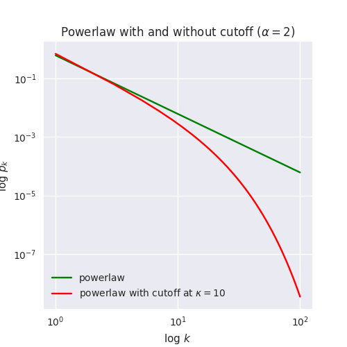

.. _model-human-population:

.. currentmodule :: epydemic

Modelling human contact networks
================================

**Problem**: You want to work with a realistic model of a human
contact network. What is the appropriate topology?

**Solution**: This is an active area of research, but a common answer
is to use the approach given by Newman :cite:`NewmanEpidemicDisease`,
which is to use a powerlaw network with exponential cut-off.

.. note ::

    This ensemble of networks is built-in to ``epydemic`` in the form
    of the :class:`PLCNetwork` network generator. The details below
    explain how this class of networks is constructed.

The theory
----------

A powerlaw network with exponent :math:`\alpha` has a degree
distibution given by

.. math::

    p_k \propto k^{-\alpha}

where :math:`p_k` is the probability that a randomly-chosen node in
the network will have degree :math:`k`. This degree distribution has
the property that some nodes can have very high degrees with non-zero
probability, leading to very large hubs with high centrality. In a
population network this would introduce individuals who were massively
better connected than the others, which is generally considered
undesirable: therre are limits to how many people even the most
popular person can actually come into physical contact with.

A powerlaw-with-cutoff network, by contrast, place a limit (denoted
:math:`\kappa`) on the "likely" highest degree.  Up to the cutoff the
degree distribution behaves like a powerlaw network; above the cutoff,
the probability drops off exponentially quickly, making large hubs
highly unlikely. This degree distribution is given by

.. math::

    p_k \propto k^{-\alpha} \, e^{-k / \kappa}

The following plot shows the difference in the probability of encountering nodes of different degrees under
the two distributions.

So the probability of finding, for example, a node of degree 100 is :math:`p_k \approx 0.0001` under the powerlaw
distribution, whereas with a cutoff at :math:`\kappa = 10` the probability drops to :math:`p_k \approx 0.00000001`
-- ten thousand times smaller.

Note that these distributions are expressed as proportionalities, because that exposes the essence of what's going on. To
actually implement the distributions, though, we need to know the constants of proportionality :math:`\frac{1}{C}` that normalise the
distribution so that the area under the curve is one. For the powerlaw with
cutoff this constant is built from a `polylogarithm <https://en.wikipedia.org/wiki/Polylogarithm>`_, :math:`C = Li_\alpha(e^{-1 /\kappa})`, a "special" function that's
fortunately built-into the ``mpmath`` package,
so all we need to do is code-up the distribution function in Python. (The equivalent for the powerlaw distribution is
built from the `Hurwitz zeta function <https://en.wikipedia.org/wiki/Hurwitz_zeta_function>`_, :math:`C = \zeta(\alpha, 1)`.)

The engineering
---------------

We can now simply code-up this mathematics, using parameters for the size :math:`N` of the network
its exponent :math:`\alpha` and cutoff :math:`\kappa` to construct a :class:`NetworkGenerator` for
this class of network:

.. code-block:: python

    import networkx
    import epydemic
    import math
    import numpy
    from mpmath import polylog

    def PowerLawWithCutoffNetwork(epydemic.NetworkGenerator):

	N = 'hcn.N'           #: Experimental parameter for the order of the network
	ALPHA = 'hcn.alpha'   #: Experimental parameter for the exponent of the distribution
	KAPPA = 'hcn.kappa'   #: Experimewntal parameter for the cutoff of the distribution

	def __init__(self, params=None, limit=None):
	    super(PowerLawWithCutoffNetwork, self).__init__(params, limit)

	def _makePowerlawWithCutoff(self, alpha, kappa):
	    '''Create a model function for a powerlaw distribution with exponential cutoff.

	    :param alpha: the exponent of the distribution
	    :param kappa: the degree cutoff
	    :returns: a model function'''
	    C = polylog(alpha, math.exp(-1.0 / kappa))
	    def p( k ):
		return (pow((k + 0.0), -alpha) * math.exp(-(k + 0.0) / kappa)) / C
	    return p

	def _generateFrom(self, N, p, maxdeg=100):
	    '''Generate a random graph with degree distribution described
	    by a model function.

	    :param N: number of numbers to generate
	    :param p: model function
	    :param maxdeg: maximum node degree we'll consider (defaults to 100)
	    :returns: a network with the given degree distribution'''
	    rng = numpy.random.default_rng()
	    ns = []
	    t = 0
	    for i in range(N):
		while True:
		    # draw a random degree
		    k = rng.integers(1, maxdeg)

		    # do we include a node with this degree?
		    if rng.random() < p(k):
			# yes, add it to the sequence; otherwise,
			# draw again
			ns.append(k)
			t += k
			break

	    # the final sequence of degrees has to sum to an even
	    # number, as each edge has two endpoints
	    # if the sequence is odd, remove an element and draw
	    # another from the distribution, repeating until the
	    # overall sequence is even
	    while t % 2 != 0:
		# pick a node at random
		i = rng.integers(0, len(ns) - 1)

		# remove it from the sequence and from the total
		t -= ns[i]
		del ns[i]

		# choose a new node to replace the one we removed
		while True:
		    # draw a new degree from the distribution
		    k = rng.integers(1, maxdeg)

		    # do we include a node with this degree?
		    if rng.random() < p(k):
			# yes, add it to the sequence; otherwise,
			# draw again
			ns.append(k)
			t += k
			break

	    # populate the network using the configuration
	    # model with the given degree distribution
	    g = networkx.configuration_model(ns,
					     create_using=networkx.Graph())
	    return g

	def _generate(self, params):
	    '''Generate the human contact network.

	    :param params: the experimental parameters
	    :returns: a network'''
	    N = params[self.N]
	    alpha = paramns[self.ALPHA]
	    kappa = params[self.KAPPA]

	    return self._generateFrom(N, self._makePowerlawWithCutoff(alpha, kappa))

The ``_makePowerlawWithCutoff()`` method just transcribes the
definition of the distribution from above, taking the distribution
parameters :math:`\alpha` and :math:`\kappa` and returning a model
function that, for any degree :math:`k`, returns the probability
:math:`p_k` of encountering a node of that degree.

The actual construction of the network is done in the
``_generateFrom()`` method using the configuration model, where we
first build a list of :math:`N` node degrees by repeatedly drawing
from the powerlaw-with-cutoff distribution. (Actually this function
will construct a network with *any* desired degree distribution by
defining an appropriate model function.)

The ``_generate()`` method unpacks the order, exponent, and cutoff
parameters and passes them to the methods that actually do the work.

You can use this code to create human population models that you then
pass to an experiment (an instance of :class:`Dynamics`) that runs the
appropriate network process over the network.

The limitations
---------------

The reason for the lack of agreement on the structure of human contact
networks is due to a detailed feature of the above formulation. If
you're interested, read on....

If you think about your own friends, two of them chosen at random are
more likely to be friends of each other than are two people chosen
from the population at large: there's a *conditional probability* at
work that makes people with a mutual friend more likely to be friends
of each other. This isn't always the case -- lots of people have
largely disjoint sets of friends -- but in general the conditional
probability is significantly higher than the general population
probability.

In a network, this phenomenon manifests itself as clusters in the
network: groups of individuals who are more connected than you might
expect to each other. Often this manifests itself as triangles of
three friends, or even larger clusters for family groups or school
classes, where everyone is in contact with everyone else.

The problem that arises is that the configuration model, which we use
above to create the network from the degree probabilities, *almost
never* generates these sorts of clusters. The networks it generates
are referred to as *locally tree-like* and don't have triangles or
higher-order clusters. (In fact they don't have cycles either, which
are weaker than clusters.)

This wouldn't matter except that clustering is now known to affect the
spread of epidemic diseases through a population. In a clustered
network, if a neighbour of a node becomes infected, then it can infect
the node directly (as one would expect) *or* it can infect one of its
other neighbours who *then* (because of clustering) infects the node
-- and there might be multiple opportunities for this to happen in a
large cluster. The net result is an epidemic that's larger and faster
in the preesence of clustering: not radically different, but
definitely observable.

There is a substantial more recent literature on clustered networks
that is essential for handling this problem: Miller :cite:`MilllerClusteredPercolation` is a
good starting point. Dobson :cite:`em` presents a method for
creating networks that mimic physical distancing countermeasures to
epidemics.  Also see Melnik *et alia* :cite:`UnreasonableEffectiveness` for a discussion
of why clustering often *doesn't* matter.
