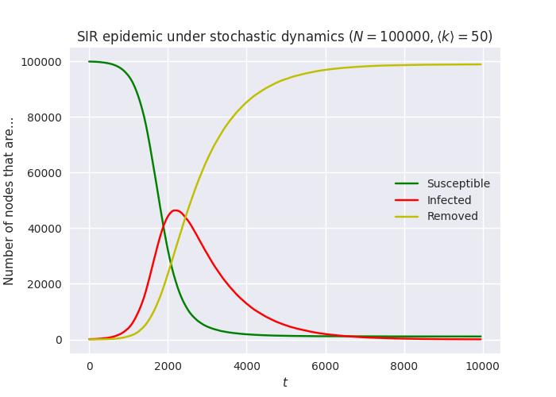
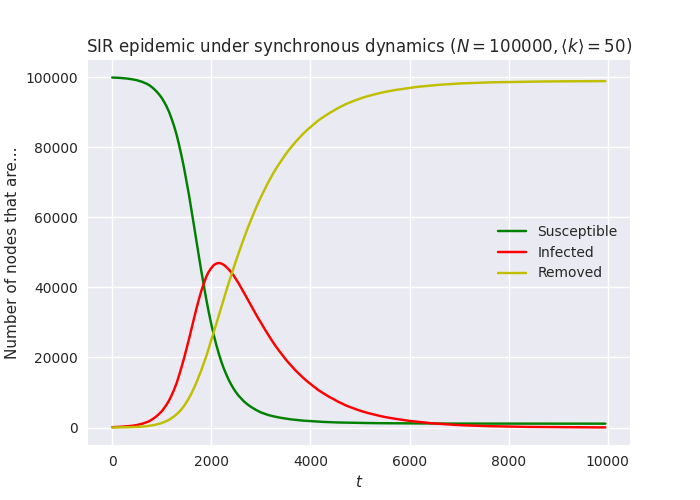

.. _implementation-dynamics:

.. currentmodule:: epydemic

Simulation dynamics
===================

The `events <implementation-=events>`_ of a simulation are only half
the story: they need to be generated and executed in the correct
order. This is the job of the dynamics classes, the sub-classes of
:class:`Dynamics`.

``epydemic`` has two simulation dynamics, for continuous-time and
discrete-time simulation. In most cases continuous time (stochastic)
dynamics is the correct choice, but we explain below in detail how
they differ.

Continuous-time (stochastic or Gillespie) dynamics
--------------------------------------------------

A :class:`StochasticDynamics` is a :term:`continuous time`
simulator. It maintains a joint probability distribution defining the
probability of a given event occurring in a given time interval into
the future. It draws from this distribution, advances the simulation
time by the chosen interval, runs any posted events that should have
occurred before this time, and then chooses an element on which to run
the event. This technique is known as :term:`Gillespie simulation`.

Let's define a variant of :class:`SIR` extended to capture the
contents of *all* its loci:

.. code-block:: python

    class MonitoredSIR(SIR):
	'''An SIR model that tracks all its compartments.'''

	def build(self, params):
	    super().build(params)
	    self.trackNodesInCompartment(SIR.SUSCEPTIBLE)
	    self.trackNodesInCompartment(SIR.REMOVED)

We can set up a single simulation of this model under stochastic
dynamics very easily:

.. code-block:: python

   # network topological parameters (for an ER network)
   N = int(1e5)
   kmean = 50

   # set up the simulation
   param = dict()
   param[ERNetwork.N] = N
   param[ERNetwork.KMEAN] = kmean
   param[SIR.P_INFECTED] = 0.001
   param[SIR.P_INFECT] = 0.0001
   param[SIR.P_REMOVE] = 0.001
   param[Monitor.DELTA] = 1

   e = StochasticDynamics(ProcessSequence([MonitoredaSIR(), Monitor()]),
			  ERNetwork())
   rc = e.set(param).run()

At each event the dynamics will choose what event should happen next,
and after how much time, based on the rates at which events can
occur. A rate is simply the probability of an event of a given type
happening (taken from the experimental parameters) multiplied by the
number of possible sites for the event to happen (taken from the size
of the locus at which the event occurs). Plotting the results we get:

This approach to simulation is both efficient and statistically exact,
which make it generally the default choice for simulations inn
``epydemic``. Occasionally, though, we want to run experiments
differently.

Discrete-time (synchronous) dynamics
------------------------------------

A :class:`SynchronousDynamics` is a :term:`discrete time`
simulator. At each timestep it runs all the events posted before this
time that remain to run, and then checks all the elements that *might*
have an event run on them and selects those that *do* undergo events
using the given event probability.

We can run the *same* model with the *same* parameters, and just
change the simulation dynamics:

.. code-block:: python

   e = SynchronousDynamics(ProcessSequence([MonitoredaSIR(), Monitor()]),
			   ERNetwork())
   rc = e.set(param).run()

Running this simulation will look at the important loci every unit of
time and, for each element decide whether to run an infection event
(for an SI edge) or a removal event (for an I node) depending on the
values of the experimental parameters. Plotting the results we get:

The stochastic case is generally faster than synchronous case. This is
unsurprising: the probability of an SI edge passing an infection (for
example) is low in any timestep, so most of the checks that the
simulation performs will fail. By contrast the stochastic dynamics
"steps over" time when nothing is happening. It is also statistically
exact, in that the next event (and the time until it) is chosen using
all the available information relating to all previous events, rather
than all the one in the previous timestep as happens in the
synchronous case. This can sometimes lead to different curves even for
the same parameters.
